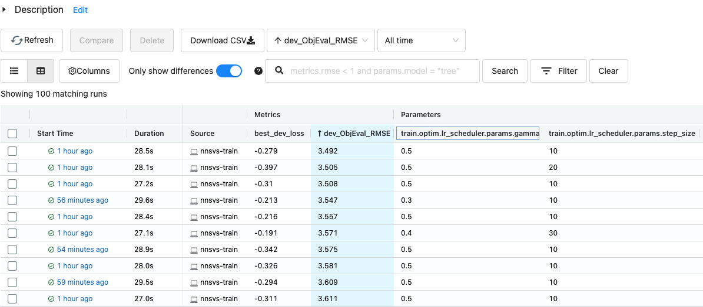
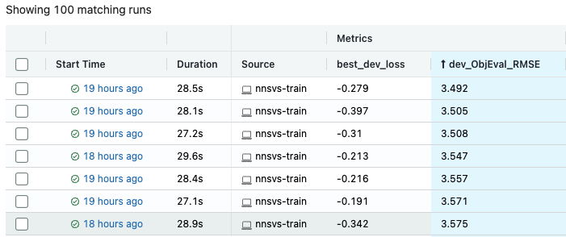

Hyperparameter optimization with Optuna
=======================================

It is often frustrating to search optimal hyperparamters (e.g., learning rate and step size) by the trial-and-error methodology.
To address this situation, NNSVS integrates `Optuna <https://github.com/optuna/optuna>`_, a hyperparameter optimization framework.

You can check the following blog post to know more about the hyperparameter optimization with Optuna: `Easy Hyperparameter Management with Hydra, MLflow, and Optuna <https://medium.com/optuna/easy-hyperparameter-management-with-hydra-mlflow-and-optuna-783730700e7d>`_.

The rest of the page briefly describes the steps to perform hyperparameter optimization with NNSVS.

.. note::
    It is not recommended to use Google Colab for hyperparameter optimization as it takes a lot of time to perform many trials.

Requirements
------------

To perform hyperparameter optimization, you need to install `mlflow <https://mlflow.org/>`_ , `hydra <https://hydra.cc/>`_  and `Optuna <https://github.com/optuna/optuna>`_. Please run the following command at the top of NNSVS directory:

.. code::

   pip install -e ".[dev]"

Or if you want to install requirements explicitly, you can run the following command:

.. code::

   pip install mlflow optuna hydra-optuna-sweeper

Run mlflow
----------

Before running the hyderparameter optimization, you need to run mlflow. Mlflow is used to visualize and track results of hyperparameter search as shown in the top figure of this page.

.. code::

    mlflow ui --host 0.0.0.0

If you are running mlflow locally, please go to ``localhost:5000`` with your web browser. If you are running mlflow on a remote server, you may need to access mlflow by ``https://{server_address}:{port_number}``.

How to run hyperparameter optimization
--------------------------------------

Once the mlflow is up, you are ready to run hyperparameter optimization.

Running the hyperparameter optimization is basically the same as running the training steps except for a few special arguments.
Specially, you need to provide the following optimization-related parameters in ``config.yaml``:

.. code-block:: yaml

    # Advanced settings for hyperparameter search with Hydra and Optuna.
    # https://hydra.cc/docs/plugins/optuna_sweeper/
    # NOTE: Don't use spaces for each search space configuration.
    # OK: data.batch_size=range(1,16)
    # NG: data.batch_size=range(1, 16)
    # Example 1: data.batch_size=range(1,16) model.netG.hidden_dim=choice(32,64,128)
    # Example 2: train.optim.optimizer.params.lr=interval(0.0001,0.01)
    timelag_hydra_optuna_sweeper_args:
    timelag_hydra_optuna_sweeper_n_trials: 100
    duration_hydra_optuna_sweeper_args:
    duration_hydra_optuna_sweeper_n_trials: 100
    acoustic_hydra_optuna_sweeper_args:
    acoustic_hydra_optuna_sweeper_n_trials: 100

- ``*_sweeper_args`` specifies the search space for the hyperparameter optimization.
- ``*_sweeper_n_trials`` specifies the number of trials for the hyperparameter optimization.

If your custom recipes don't have the above parameters in ``config.yaml``, please add them manually.
You can specify the search space by following the above comments and examples.

An example to perform hyperparameter optimization
---------------------------------------------------

The following example was took from my command line history. You may refer to my example as a starting point.

.. code-block:: bash

    CUDA_VISIBLE_DEVICES=0 ./run.sh  --stage 3 --stop-stage 3 \
        --tag test_optuna \
        --duration-hydra-optuna-sweeper-args "train.optim.optimizer.params.lr=interval(0.0001,0.01) train.feats_criterion=choice(l1,l2) train.optim.lr_scheduler.params.step_size=choice(10,20,30,40,50) train.optim.lr_scheduler.params.gamma=choice(0.1,0.2,0.3,0.4,0.5)"

A detailed explanation of the arguments:

- ``train.optim.optimizer.params.lr=interval(0.0001,0.01)``: Specifies the search space for the learning rate.
- ``train.feats_criterion=choice(l1,l2)``: Specifies the search space for the feature loss criterion.
- ``train.optim.lr_scheduler.params.step_size=choice(10,20,30,40,50)``: Specifies the search space for the learning rate scheduler's step size.
- ``train.optim.lr_scheduler.params.gamma=choice(0.1,0.2,0.3,0.4,0.5)``: Specifies the search space for the learning rate scheduler's gamma.

Note that you can specify the search space by several different methods (e.g., ``choice`` and ``interval``).
For more details, please refer to the `Optuna sweeper documentation <https://hydra.cc/docs/plugins/optuna_sweeper/>`_.

Once the hyperparameter optimization is finished, you can find best parameters that achieved the best dev loss on the mlflow UI.
As shown below, it is useful to sort results by objective metrics such as root mean squared error (RMSE), mel-cepstrum distortion (MCD), and F0-RMSE, V/UV errors.

The smaller the better for most metrics. Smaller development loss generally means smaller RMSE or MCD but note that it is not guaranteed.

Notes
-----

Development set
~~~~~~~~~~~~~~~~

Hyperparameter optimization is performed to find the set of parameters that yields the **best development loss**.
Therefore, it is better to use a large portion of data for the development set. Otherwise you may suffer from over-fitting issues.

Number of trials
^^^^^^^^^^^^^^^^

The default number of trials is set to 100. This is not so large for training time-lag/duration models. However, for training acoustic models, it is recommended to set the number of trials to a smaller value unless you have sufficient compute resources. If you perform 100 trials for training acoustic models, it is likely to take weeks to complete.
