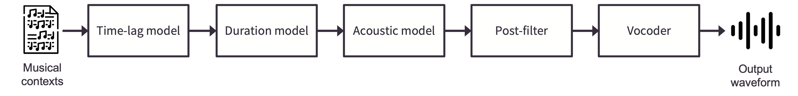
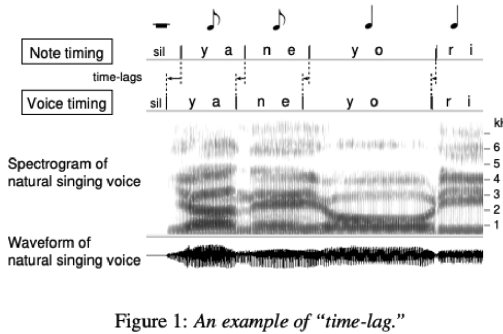
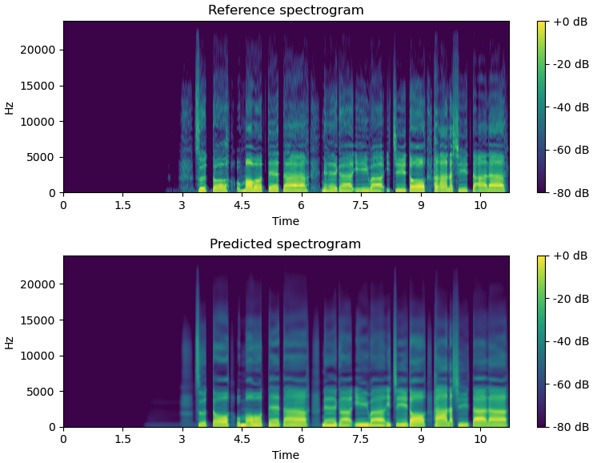
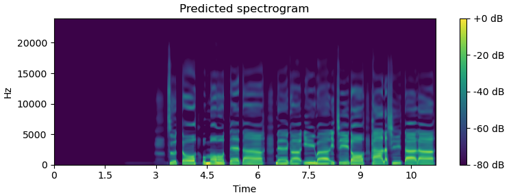
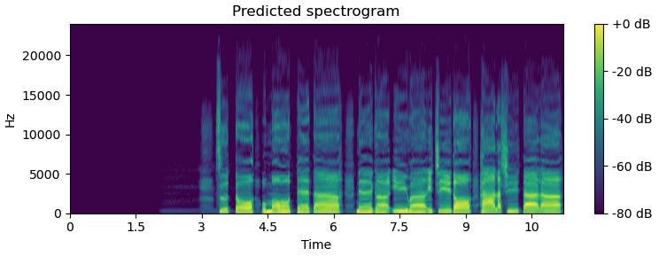

Overview of NNSVS's SVS
=======================

NNSVS provides functionality to build singing voice synthesis (SVS) systems.
The above figure shows the overview of NNSVS's SVS.
There are five modules that can be modeled by neural networks. Brief descriptions of each module are given below.

Time-lag model
--------------

A time-lag model takes a musical score as input and outputs the time-lag for each note.
A time-lag is defined as note onset difference between a musical score and an actual singing voice.
An illustration of the time-lag is shown below. The figure was taken from :cite:t:`saino2006hmm`.

Following Sinsy, a musical score is represented as `HTS <https://hts.sp.nitech.ac.jp/>`_-style full-context labels.
The full-context labels are internally converted to an array-like representation that contains categorical and numeric featrues.
And those features are used as the input of neural networks.

Duration model
---------------

A duration model takes a musical score as input and outputs durations for each phoneme.
The duration model is pretty much the same as the one used in traditional statistical parametric text-to-speech (TTS) systems.
You can find more details in :cite:t:`zen2009statistical`.

Acoustic model
---------------

An acoustic model predicts acoustic features from a musical score.
The acoustic feature typically consists of:

- ``mgc``: Mel-generalized cespstrum
- ``lf0``: logarithmic fundamental frequency
- ``vuv``: voiced and unvoiced flags,
- ``bap``: band aperiodicity

Predicting ``mgc`` and ``lf0`` is the most important part for intelligibility and expressiveness.
The above four features can be extracted by a vocoder.
Newer models may use vibrato frequency/amplitude as additional features for vibrato modeling (:cite:t:`nakano2006automatic`).
Note that NNSVS adopts WORLD (:cite:t:`morise2016world`) as the primary vocoder.

Some recent work adopts Mel-spectrogram as the acoustic features (:cite:t:`gu2021bytesing`). We have plans to support this feature in the future.

The figure below illustrates how the acoustic model works.

It is often observed that the predicted features are over-smoothed especially if we train a neural network with mean squared error loss. We can address this issue to some extent by a post-filter.

Post-filter
------------

A post-filter is a post-processing module, typically applied for spectral features only.
There are multiple choices to address the over-smoothing problem by a post-filter as follows:

- Spectral enhancement (:cite:t:`wu2016merlin`)
- Global variance (GV) or modulation spectrum (MS) based post-filters (:cite:t:`silen2012ways`, :cite:t:`takamichi2016postfilters`)
- Learned post-filter (:cite:t:`Kaneko2017Interspeech`, :cite:t:`kaneko2017generative`)

The first one is what NNSVS has been using since the first release.
The newer NNSVS support GV post-filter and learned post-filter to further improve the synthetic quality.

The following figures show how the learned post-filter works (above: before post-filtering, bottom: after post-filtering).
Note that learned post-filter is currently under development.

Vocoder
--------

The vocoder is a model that generates waveform from acoustic features. NNSVS adopts WORLD (:cite:t:`morise2016world`) as the primiary vocoder.
We have plans to support neural vocoders but its support is currently limited.
Neural source-filter models (:cite:t:`wang2019neural`) will be available in the near future.

Difference with Sinsy
---------------------

The design of our system is mostly inspired by one of the frontier statistical model-based SVS system, Sinsy (:cite:t:`hono2021sinsy`).
Sinsy was originally based on hidden Markov models (HMMs) but they adopted neural networks in their recent work.
Note that the NNSVS's SVS systems are not limited to the pipeline architecture and can be configured differently.

The most important difference between NNSVS and Sinsy is its open-/closeed-source policy.
NNSVS is fully open-source, while Sinsy is not. Specifically, Sinsy's neural network-based models are closed source. Note that Sinsy stopped their open-source updates at Dec. 2015.

Furthermore, thanks to the open-source nature of NNSVS, one can create their own SVS systems by recoding database by themselves. This is actually what the vocal synth community has been doing after the NNSVS (and ENUNU) release.
