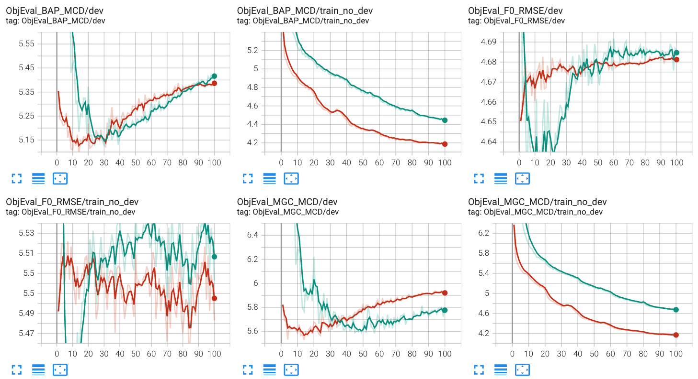
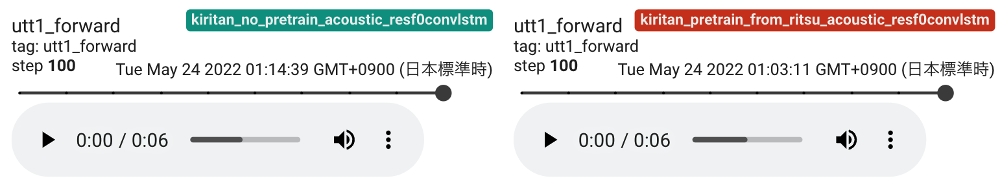

Tips
=====

This page summarizes tips for NNSVS.

Database creation for NNSVS/ENUNU
----------------------------------

A detailed tutorial for for making voice banks can be found at `NNSVS Database Making Tutorial <https://docs.google.com/document/d/1uMsepxbdUW65PfIWL1pt2OM6ZKa5ybTTJOpZ733Ht6s/edit?usp=sharing>`_ (by `PixProcuer <https://twitter.com/PixPrucer>`_). It is worth checking Q&A section if you encounter any problems.

How to avoid GPU OOM
--------------------

Here are some things to try when you see GPU out-of-memory (OOM) errors:

- Reduce batch size. Most recipes use batch size of 8 by default, but it is okay to set it to 2 for example.
- If you still see GPU OOM even if you set small batch size, try to reduce the model size by changing number of layers, number of hidden units, etc.
- (Only if you have supported NVIDIA GPUs) Enable mixed precision training. You can save GPU RAM while accelerating training.
- Set ``max_time_frames`` in your data config. This option forces the sequence length of every mini-batch to ``max_time_frames``.

How much VRAM is required?
-----------------------------

10GB or larger is recommended in general. Note that the amount of required VRAM depends on what models you want to train.

Monitoring traing progress via Tensorboard
-------------------------------------------

New feature in NNSVS v0.0.3

Please consdier using `Tensorboard <https://www.tensorflow.org/tensorboard>`_ for monitoring training progress.
You can run Tensorboard by:

.. code-block:: bash

    tensorboard --logdir=/path/to/tensorboard/logs

If you use the latest version of train_resf0.py, you can see spectrogram, F0, aperiodicity visualization.
Limited support is available for train.py.

.. image:: _static/img/tensorboard_spectrogram.png
   :alt: Spectrogram visualization on Tensorboard

You can check audio outputs on Tensorboard.

Building SVS systems with small amount of data
-----------------------------------------------

Try fine-tuning from a pre-trained model. Note that the model architecture must be the same between the pre-trained model and the model you are going to train.

For example, the publicly available version of nit-song070 database only contains 30 songs, and it is difficult to train quality models with it. In this case, you can consider using fine-tuning from models trained on kiritan_singing database.

Any of time-lag/duration/acoustic models can benefit from pre-training/fine-tuning. However, pre-training/fine-tuning is most important for acoustic models.

Debugging NNSVS
----------------

If you want to debug NNSVS's core library, it is recommended to use debugging tools such as `ipdb <https://github.com/gotcha/ipdb>`_ or `pdb <https://docs.python.org/3/library/pdb.html>`_. I prefer to use ``ipdb`` for general purpose debugging of Python code.

Other tips
-----------

- The number of epochs: 50 would be enough for most cases. For training acoustic models, 100 may work better. For MDN-based acoustic models, you would try 200 or more.
- Don't over-trust dev loss. It is well known that loss is not closely correlated to subjective quality.
- No problem with negative loss for MDN models.
- Use smaller ``pitch_reg_weight`` if your audio and note pitch is property aligned (or pitch-corrected). ``pitch_reg_weight=0.0`` works fine with Ritsu's database (V2).
