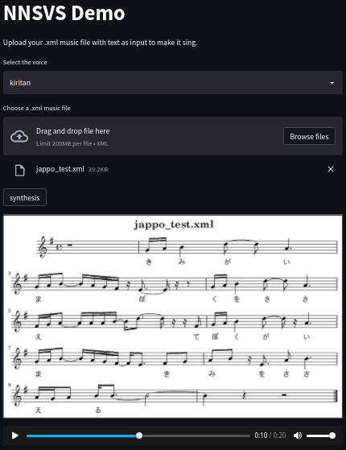

# NNSVS Streamlit demo
This folder explain how to work with this demo



* install the requirements
```
pip install streamlit git+https://github.com/r9y9/nnsvs
# or if you must specify the python version
python3.8 -m pip install streamlit git+https://github.com/r9y9/nnsvs
```
* run streaimlit app
```
streamlit run streamlit_demo/app.py
# or if you must specify the python version
python3.8 -m streamlit run streamlit_demo/app.py
```
* go on localhost:8501 and load .xml file